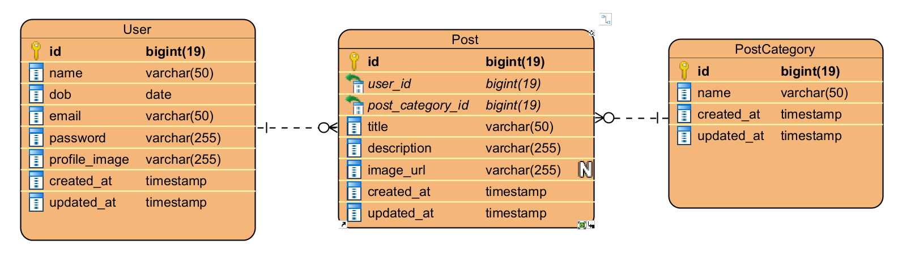

<div id="top"></div>

[![LinkedIn][linkedin-shield]][linkedin-url]

<!-- PROJECT LOGO -->
<br />
<div align="center">
  <h3 align="center">Dot Challange</h3>

  <p align="center">
    This project is used for dot applicatoin
    <br />
    <a href="https://github.com/hansandika/Dot-Application"><strong>Explore the docs »</strong></a>
    <br />
  </p>
</div>

<!-- TABLE OF CONTENTS -->
<details>
  <summary>Table of Contents</summary>
  <ol>
    <li>
      <a href="#about-the-project">About The Project</a>
      <ul>
        <li><a href="#built-with">Built With</a></li>
        <li><a href="#built-with">Database ERD</a></li>
      </ul>
    </li>
    <li>
      <a href="#getting-started">Getting Started</a>
      <ul>
        <li><a href="#prerequisites">Prerequisites</a></li>
        <li><a href="#installation">Installation</a></li>
      </ul>
    </li>
    <li><a href="#usage">API Reference</a></li>
    <li><a href="#contact">Contact</a></li>
  </ol>
</details>

<!-- ABOUT THE PROJECT -->

## About The Project

<div align="center" rounded="true">
  
  This project is created for applying in DOT
</div>

<p align="right">(<a href="#top">back to top</a>)</p>

### Built With

This section should list any major frameworks/libraries used to bootstrap your project. Leave any add-ons/plugins for the acknowledgements section. Here are a few examples.

-   [![Laravel][laravel.com]][laravel-url]
-   [![TailwindCSS][tailwind.com]][tailwind-url]
-   [![JQuery][jquery.com]][jquery-url]
-   [![Postman][postman.com]][postman-url]

### Database ERD

<div align="center" rounded="true">
  
</div>
There are three table that are used in this project such as User, Post, and PostCategory.
<p align="right">(<a href="#top">back to top</a>)</p>

<!-- GETTING STARTED -->

## Getting Started

### Prerequisites

-   npm
    ```sh
    Install npm
    ```
-   composer
    ```sh
    Intall composer
    ```
-   php
    ```sh
    PHP 8.0.21
    ```

### Installation

1. Clone the repo
    ```sh
    git clone https://github.com/hansandika/Dot-Application
    ```
2. Install NPM packages
    ```bash
    npm install
    ```
3. Enter your database name in `.env`
    ```sh
    DB_DATABASE = database_name
    ```
4. Migrate the table to database
    ```bash
    $ php artisan migrate:fresh --seed
    ```

<p align="right">(<a href="#top">back to top</a>)</p>

<!-- USAGE EXAMPLES -->

## API Reference

You have to **signup** and then **login** to be able to apply CRUD for post.

#### Sign Up

```http
  POST /api/register
```

| Parameter          | Type      | Description                    |
| :----------------- | :-------- | :----------------------------- |
| `email`            | `string`  | **Required, email, unique**    |
| `password`         | `string`  | **Required, min:7, alpha_num** |
| `confirm-password` | `string`  | **Required, same:password**    |
| `dob`              | `date`    | **Required, before:today**     |
| `agreement`        | `boolean` | **Required**                   |

#### Login

```http
  POST /api/login
```

| Parameter  | Type     | Description         |
| :--------- | :------- | :------------------ |
| `email`    | `string` | **Required, email** |
| `password` | `string` | **Required**        |

<p align="right">(<a href="#top">back to top</a>)</p>

## Environment Variables

To run this project, you will need to add environment variables to your .env file. A sample of this can be found in [.env.sample](./.env.sample)

<p align="right">(<a href="#top">back to top</a>)</p>
<!-- CONTACT -->

## Contact

Hans Geovani Andika - [https://www.linkedin.com/in/hans-geovani-andika/](https://www.linkedin.com/in/hans-geovani-andika/) - hansandika70@gmail.com

Project Link: [https://github.com/hansandika/Dot-Application](https://github.com/hansandika/Dot-Application)

<p align="right">(<a href="#top">back to top</a>)</p>

[linkedin-shield]: https://img.shields.io/badge/-LinkedIn-black.svg?style=for-the-badge&logo=linkedin&colorB=555
[linkedin-url]: https://www.linkedin.com/in/hans-geovani-andika/
[product-screenshot]: images/screenshot.png
[laravel.com]: https://img.shields.io/badge/Laravel-FF2D20?style=for-the-badge&logo=laravel&logoColor=white
[laravel-url]: https://laravel.com
[tailwind.com]: https://img.shields.io/badge/tailwindcss-%2338B2AC.svg?style=for-the-badge&logo=tailwind-css&logoColor=white
[tailwind-url]: https://tailwindcss.com/
[jquery.com]: https://img.shields.io/badge/jQuery-0769AD?style=for-the-badge&logo=jquery&logoColor=white
[jquery-url]: https://jquery.com
[postman.com]: https://img.shields.io/badge/Postman-FF6C37?style=for-the-badge&logo=postman&logoColor=white
[postman-url]: https://www.postman.com/
